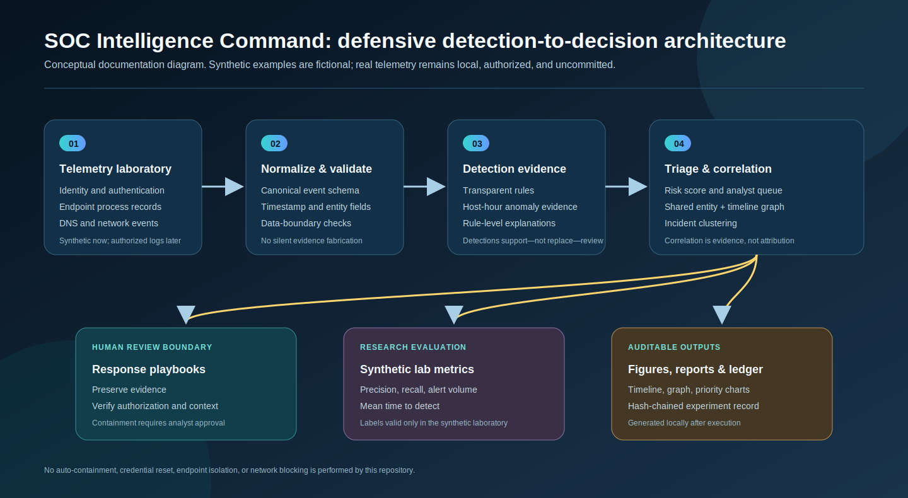
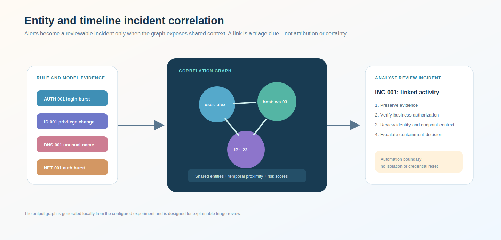
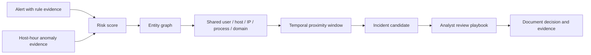
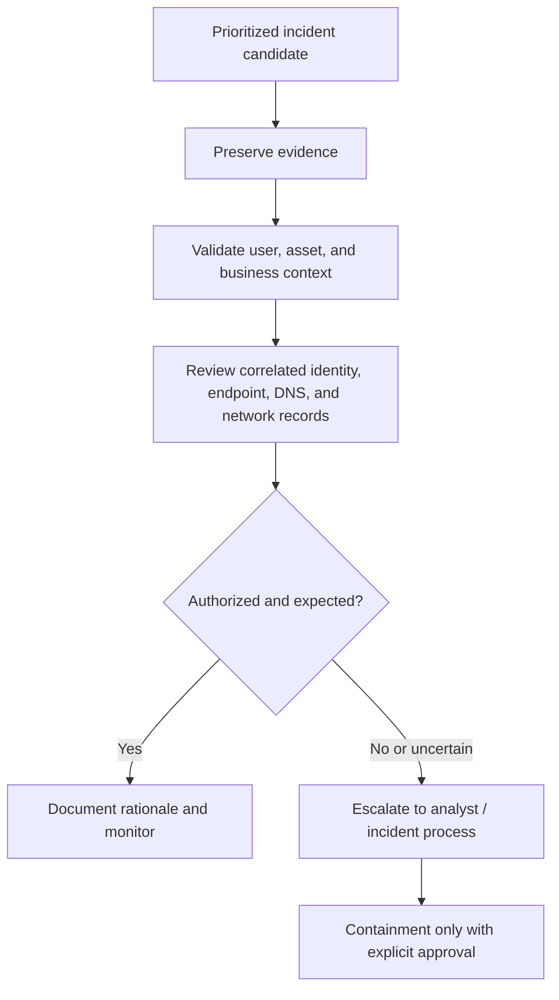

# SOC Intelligence Command

<p align="center"><strong>Defensive security-operations research infrastructure for transparent detection, anomaly evidence, alert prioritization, entity correlation, and human-reviewed response recommendations.</strong></p>

<p align="center">
  <a href="../../actions/workflows/python-checks.yml"></a>
  <a href="LICENSE"></a>
  
  
</p>

> **Defensive boundary:** this independent academic prototype produces analysis and analyst-review recommendations only. It does not execute containment, reset accounts, isolate endpoints, block network traffic, or connect to real systems. Any future real telemetry must be authorized, local, and excluded from Git.

---

## Research objective

Can a transparent multi-stage SOC pipeline combine rule-based detection, anomaly evidence, alert prioritization, and entity-level correlation to reduce analyst workload while preserving visibility, explainability, and response accountability?

| Research question | Evidence generated only after local execution |
| --- | --- |
| Can interpretable rules surface defender-relevant suspicious patterns? | Rule hits, evidence strings, and synthetic-label regression metrics |
| Can anomaly evidence improve triage context without replacing rules? | Host-hour anomaly score attached to alerts |
| Can entity and time correlation turn fragmented alerts into reviewable incident candidates? | Correlation graph and incident table |
| Can prioritization improve analyst queue visibility? | Risk rationale, priority distribution, alert timeline |
| Can response guidance remain useful without unsafe automation? | Human-review playbooks and audit trail |

---

## Architecture

<p align="center"></p>

The image is a documentation diagram. It is not an operational SOC screenshot, a claim of deployed capability, or a data-derived result.

| Layer | Function | Trust control |
| --- | --- | --- |
| Telemetry laboratory | Synthetic identity, endpoint, DNS, and network events | Fictional by default; real logs remain local and authorized |
| Normalization | Canonical timestamps, entities, event types, and criticality | Does not fabricate missing evidence |
| Detection | Interpretable threshold and pattern rules | Evidence text for every hit |
| Anomaly evidence | Host-hour behavioral scoring | Supports triage; never a verdict alone |
| Prioritization | Severity, confidence, criticality, anomaly, recency | Explicit risk rationale and bounded score |
| Correlation | Shared entities plus temporal context | Candidate incident, not attribution |
| Response | Evidence preservation and review steps | Human approval required for impactful actions |
| Auditability | Structured results and hash-chained ledger | Reproducible seed and run metadata |

---

## Run today — no dataset needed

The repository includes a deterministic **synthetic SOC laboratory**. It generates a fictional multi-source event stream, injects high-level defender-relevant scenarios, then runs the full pipeline.

```bash
python scripts/run_synthetic_soc_lab.py
```

Windows quick start:

```bat
cd %USERPROFILE%\soc-intelligence-command
git pull

py -m venv .venv
.venv\Scripts\activate

python -m pip install --upgrade pip
python -m pip install -r requirements.txt
python scripts/run_synthetic_soc_lab.py
```

Optional reproducibility controls:

```bash
python scripts/run_synthetic_soc_lab.py --days 21 --seed 42
```

The synthetic laboratory produces actual local evidence artifacts:

```text
outputs/results/synthetic_events.csv
outputs/results/synthetic_host_hour_anomalies.csv
outputs/results/synthetic_alerts.csv
outputs/results/synthetic_incidents.csv
outputs/results/synthetic_response_recommendations.csv
outputs/results/synthetic_soc_summary.json
outputs/results/audit_ledger.jsonl
outputs/reports/synthetic_soc_brief.md

outputs/figures/synthetic_alert_volume_by_rule.png
outputs/figures/synthetic_alert_timeline.png
outputs/figures/synthetic_priority_distribution.png
outputs/figures/synthetic_incident_correlation_graph.png
```

All generated files retain the word **synthetic**. They demonstrate executable workflow and reproducibility only; they are not empirical claims about a real organization.

---

## Synthetic laboratory scenarios

| Scenario | Fictional signal pattern | Detection evidence | Analyst interpretation |
| --- | --- | --- | --- |
| Credential pressure | Repeated authentication failures, then a successful sign-in | `AUTH-001`, `AUTH-002` | Verify account context and source-network authorization |
| Privilege change | Role assignment linked by identity context | `ID-001` | Validate approval and business purpose |
| Multi-host remote access | Multiple remote authentications in a short interval | `NET-001` | Determine approved administration versus suspicious access |
| Unusual DNS | Long character-diverse DNS names | `DNS-001` | Review query context; heuristic is not a verdict |
| Process lineage | Unrecognized process starting from email-client lineage | `END-001` | Preserve endpoint evidence and validate software context |

The scenarios are not attack recipes, malware simulations, or real incidents. They are deliberately limited defensive patterns for pipeline evaluation.

---

## Correlation logic

<p align="center"></p>



An incident candidate is a connected component in a graph of alert and entity nodes. It is a triage structure, not a conclusion that all related events have a single root cause.

---

## Detection and prioritization methodology

### Transparent rules

| Rule | Heuristic evidence | Severity | Educational tactic label |
| --- | --- | --- | --- |
| `AUTH-001` | Repeated login failures for a user/source in a short window | High | Credential Access; Initial Access |
| `AUTH-002` | Successful authentication outside synthetic baseline hours | Medium | Initial Access |
| `ID-001` | Successful role assignment | High | Privilege Escalation; Persistence |
| `DNS-001` | Long high-entropy DNS name | Medium | Command and Control |
| `END-001` | Unrecognized process lineage from email client | High | Execution |
| `NET-001` | Remote authentication across multiple targets | High | Lateral Movement |

The tactic labels are **educational MITRE-style annotations**, not official coverage claims.

### Priority score

Each alert receives an explainable score in the range 0–100:

```text
risk = severity + confidence + asset criticality + anomaly evidence + recency
```

The actual implementation uses documented weights and saves a `priority_rationale` field with each alert. It ranks analyst attention; it does not permit autonomous response.

### Anomaly evidence

The project aggregates host-hour behavior using event count, failed authentication count, DNS volume, remote-authentication count, identity-change count, and distinct-domain count. Isolation Forest is trained on the earlier synthetic timeline and scores the full run.

Anomaly output is supporting context, not a decision engine.

---

## Response safety boundary



Recommended responses include preserving records, confirming authorization, reviewing endpoint and identity context, and escalation. **No destructive, disruptive, or credential/network action is automated.** Read [`docs/response_playbooks.md`](docs/response_playbooks.md) for the detailed analyst guidance.

---

## Metrics and their limits

The synthetic lab includes labeled fictional events, enabling regression-test metrics:

| Measure | Meaning | Limitation |
| --- | --- | --- |
| Synthetic precision | Share of event-linked alerts matching synthetic labels | Not a real SOC false-positive rate |
| Synthetic recall | Share of synthetic labeled events linked to an alert | Not a real detection-coverage claim |
| Alert-volume reduction | Fraction of events not promoted to alerts | Does not measure analyst workload completely |
| Synthetic MTTD | Time from synthetic scenario onset to first linked alert | Depends on the fictional timestamps and labels |
| Incident count | Correlated alert components | Candidate grouping, not confirmed cases |

Do not include synthetic metrics in a professional report as real cybersecurity performance evidence.

---

## Repository map

```text
.
├── assets/                     Conceptual architecture and correlation diagrams
├── configs/                    Reproducible synthetic-laboratory configuration
├── data/                       Local telemetry boundary and schema guidance
├── docs/                       Methodology, playbooks, synthetic-lab protocol, report template
├── matlab/                     Local alert-timeline visualization
├── notebooks/                  Runnable synthetic SOC walkthrough
├── outputs/                    Local-only CSV, graph, report, and ledger artifacts
├── scripts/                    One-command synthetic SOC laboratory
├── src/socintel/
│   ├── synthetic.py            Fictional multi-source telemetry and labeled scenarios
│   ├── schema.py               Canonical SOC normalization
│   ├── detections.py           Interpretable defensive detection rules
│   ├── anomaly.py              Host-hour anomaly evidence
│   ├── scoring.py              Transparent analyst-priority score
│   ├── correlation.py          Entity and timeline incident graph
│   ├── taxonomy.py             Educational tactic labels
│   ├── playbooks.py            Human-review response recommendations
│   ├── ledger.py               Hash-chained experimental record
│   ├── reporting.py            Local analyst briefing generator
│   └── visualization.py        Executed-run charts and graph visualizations
└── tests/                      Synthetic telemetry, detection, pipeline, and ledger tests
```

---

## MATLAB integration

After running the synthetic lab:

```matlab
addpath('matlab')
plot_alert_timeline('outputs')
```

`matlab/plot_alert_timeline.m` reads the locally generated synthetic alert table and saves a separate MATLAB timeline figure. It is intentionally dependent on executed Python output.

---

## Reproducibility

- Fixed seed passed through the synthetic generator and anomaly model.
- Deterministic synthetic event IDs.
- Unit tests cover synthetic generation, detection families, prioritization/correlation, and ledger integrity.
- GitHub Actions runs the data-free test suite.
- A hash-chained local ledger records experiment metadata and metrics.

Run tests locally:

```bash
python -m pytest
```

## Real telemetry extension policy

The project is intentionally synthetic-first. To add real telemetry later, create an authorized local adapter that maps fields into `socintel.schema.normalize_events`, retain logs outside Git, document data authorization, remove or hash sensitive identifiers where appropriate, and perform analyst review before using any output operationally.

## Limitations

1. Synthetic telemetry cannot represent an organization's log quality, architecture, users, normal administration, or adversary behavior.
2. Fixed rules and anomaly models can produce false positives and false negatives.
3. Entity correlation can over-link or under-link events.
4. Educational tactic labels are not a substitute for a validated detection taxonomy.
5. Human review remains necessary for interpretation, containment, and evidence handling.
6. This repository is research infrastructure, not a production SIEM, SOAR platform, or incident-response system.

## License

Released under the [MIT License](LICENSE). Real security telemetry is not included.
